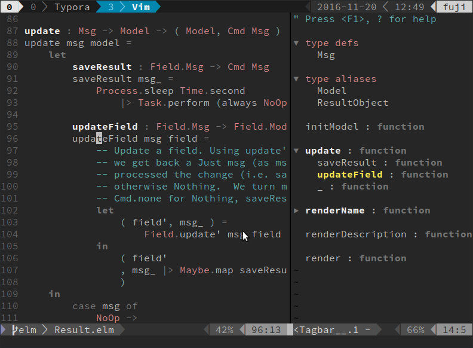

# vim-tagbar-ctags-elm

Support for [Elm](http://elm-lang.org/) in [Vim Tagbar](https://majutsushi.github.io/tagbar/) with [Universal Ctags](https://ctags.io/). This is a work in progress; when it's a bit more mature, and Universal Ctags a bit more common it will probably end up on the [Tagbar Wiki](https://github.com/majutsushi/tagbar/wiki), a [Ctags optlib](http://docs.ctags.io/en/latest/optlib.html) and a/or pull request to [elm-vim](https://github.com/ElmCast/elm-vim).

		

## Features

- Universal Ctags options for Elm supporting:
  - [x] type definitions 

  - [x] type aliases

  - [x] functions

  - [x] nested functions

        **Note**: Uses the [scope tracking](http://docs.ctags.io/en/latest/optlib.html#scope-tracking-in-a-regex-parser) features of Universal Ctags, so won't work with Exuberant Ctags. IF you want to use Exuberant Ctags, you need [ctags-elm](https://github.com/kbsymanz/ctags-elm).

  - [x] ports 

  - [ ] imports

- Vim Tagbar extension for these tag kinds.

## Bugs and limitations

* Only top level function definitions (with no white space before the function name) define scopes for nesting. E.g. in the screen shot above the `_` binding is defined in a let expression in one of the cases further down in the `updateField` function.

* Doesn't distinguish functions by airity. 

* can't  (yet) parse constructors in argument lists, hence this doesn't show up as a function:
      renderResult ( n, r ) =
  ​

## Similar projects

- [ctags-elm](https://github.com/kbsymanz/ctags-elm) got me started (thanks). Works with Exuberant Ctags, doesn't support scoped tags.
- [elm-vim](https://github.com/ElmCast/elm-vim) has tagbar support for Elm